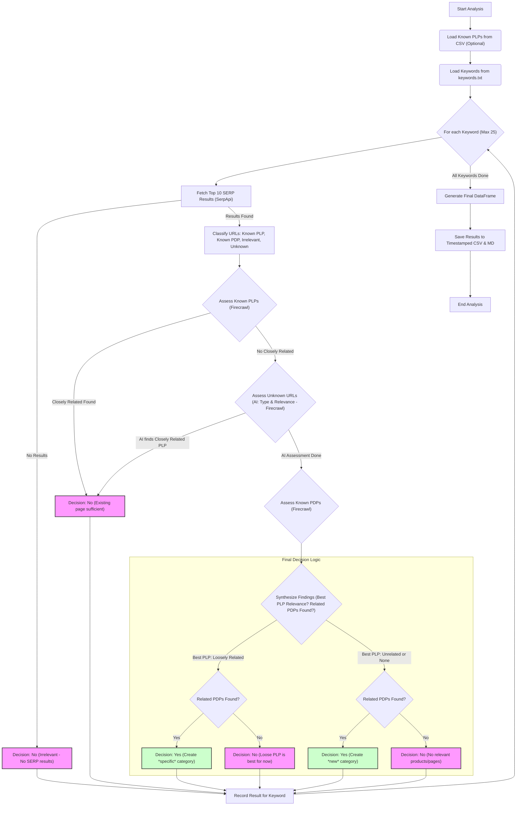

# Category Opportunity Analyzer

This script analyzes a list of keywords (potential e-commerce categories or topics) loaded from a file to determine if creating a dedicated category page on a target website is justified. It leverages Google search results (via SerpApi) and AI-powered content analysis (via Firecrawl) to classify ranking URLs and assess their relevance to each keyword.

## Prerequisites

1.  **Python 3:** Ensure you have Python 3 installed.
2.  **Libraries:** Install required libraries:
    ```bash
    pip install pandas requests python-dotenv firecrawl-py pydantic
    ```
3.  **API Keys:**
    *   **SerpApi:** Obtain an API key from [SerpApi](https://serpapi.com/).
    *   **Firecrawl:** Obtain an API key from [Firecrawl](https://firecrawl.dev/).
4.  **Environment File:** Create a file named `.env` in the same directory as the scripts and add your API keys:
    ```dotenv
    serpapi_api_key=YOUR_SERPAPI_KEY
    firecrawl_api_key=YOUR_FIRECRAWL_KEY
    ```
5.  **Keyword File:** Create a file named `keywords.txt` in the same directory. Add one keyword or topic per line. Empty lines and duplicates will be ignored.

## Configuration

Before running, configure the following settings directly within the `main_analyzer.py` script:

*   `TARGET_SITE`: The domain name of the website you want to analyze (e.g., `"example.com"`).
*   `KNOWN_PLP_PATHS`: A list of URL path prefixes that identify known Product Listing Pages (PLPs). Ensure they end with `/` if they represent directories.
*   `KNOWN_PDP_PATHS`: A list of URL path prefixes that identify known Product Detail Pages (PDPs).
*   `KNOWN_IRRELEVANT_PATHS`: A list of URL path prefixes (or exact URLs like the homepage) to ignore during analysis (e.g., `/articles/`, `/help/`). Ensure they end with `/` if they represent directories.
*   `KNOWN_PLPS_CSV_PATH`: (Optional but recommended) Path to a CSV file containing a list of known PLP URLs for more accurate classification. The CSV should have a column named `URL`. Set to `''` if not used.
*   `KEYWORD_FILE_PATH`: The path to your keyword file (defaults to `'keywords.txt'`).
*   `KEYWORD_LIST = KEYWORD_LIST[:25]`: **Note:** The script currently limits the analysis to the first 25 unique keywords found in the `keywords.txt` file. You can adjust or remove this slice (`[:25]`) if needed.
*   `DELAY_BETWEEN_KEYWORDS`: Delay in seconds between processing each keyword (API calls for SERP).
*   `DELAY_BETWEEN_URL_ASSESSMENTS`: Delay in seconds between individual Firecrawl API calls for URL analysis.
*   `OUTPUT_FILENAME_BASE`: The base name for the output files (e.g., `'outputs/category_opportunity_analysis'`). Timestamps and extensions (`.csv`, `.md`) will be appended automatically. The `outputs` directory will be created if it doesn't exist.

## How to Run

1.  Ensure your `.env` file is set up with API keys.
2.  Ensure your `keywords.txt` file exists and contains your keywords.
3.  Configure the settings in `main_analyzer.py` as needed.
4.  Run the script from your terminal:
    ```bash
    python main_analyzer.py
    ```
5.  The script will log its progress to the console and save the results to timestamped CSV and Markdown files in the specified output directory (e.g., `outputs/category_opportunity_analysis_YYYYMMDD_HHMMSS.csv` and `.md`).

## Workflow

The script follows this process for each keyword:



**Workflow Steps:**

1.  **Load Data:** Load known PLPs from the optional CSV and keywords from `keywords.txt`.
2.  **Fetch SERP:** For each keyword, get the top 10 Google search results restricted to the `TARGET_SITE`. If none are found, mark as irrelevant.
3.  **Initial Classification:** Categorize each ranking URL based on predefined paths (`KNOWN_PLP_PATHS`, `KNOWN_PDP_PATHS`, `KNOWN_IRRELEVANT_PATHS`) and the loaded known PLPs. Remaining URLs are 'Unknown'.
4.  **Assess Known PLPs:** Use Firecrawl AI to assess the relevance of 'Known PLP' URLs to the keyword ("Closely Related", "Loosely Related", "Unrelated"). If a "Closely Related" PLP is found, stop assessment for this keyword and decide "No (Existing page sufficient)".
5.  **Assess Unknown URLs:** If no closely related Known PLP was found, use Firecrawl AI to classify 'Unknown' URLs (as PLP, PDP, Brand Page, Article, Other) *and* assess their relevance simultaneously. If AI identifies a "Closely Related" PLP/Brand Page, stop assessment and decide "No (Existing page sufficient)". Keep track of the best PLP relevance found so far and whether any related PDPs were identified by AI.
6.  **Assess Known PDPs:** If no closely related PLP was found yet, use Firecrawl AI to assess the relevance of 'Known PDP' URLs ("Related", "Unrelated"). Track if any are "Related".
7.  **Synthesize & Decide:** Based on the assessments:
    *   If the best PLP found (either Known or via AI) was "Loosely Related":
        *   If any "Related" PDPs were found (Known or via AI), recommend: `Yes (Create *specific* category)`.
        *   Otherwise, recommend: `No (Loose PLP is best for now)`.
    *   If the best PLP found was "Unrelated" or no PLPs were found:
        *   If any "Related" PDPs were found, recommend: `Yes (Create *new* category)`.
        *   Otherwise, recommend: `No (No relevant products/pages)`.
8.  **Output:** Record the results for each keyword, generate a final DataFrame, and save it to timestamped CSV and Markdown files.

## Output Files

Two files are generated for each run, with identical timestamps:

1.  **`*_YYYYMMDD_HHMMSS.csv`**: Contains the detailed analysis data.
2.  **`*_YYYYMMDD_HHMMSS.md`**: Provides a formatted, readable report summary and detailed breakdown.

### CSV File Columns

*   `Keyword`: The keyword/topic analyzed.
*   `Decision`: The final recommendation (e.g., `Yes (Create *new* category)`, `No (Existing page sufficient)`, `No (Loose PLP is best for now)`, etc.).
*   `Justification`: A brief explanation for the `Decision`.
*   `SERP_Results_Found`: Boolean indicating if any organic results were found on the target site.
*   `SERP_Raw_HTML_URL`: Link to the cached SerpApi raw HTML file for the search results (if available).
*   `Initial_Classification`: String representation of a dictionary showing lists of URLs initially classified based on patterns (`{'Known PLP': [...], 'Known PDP': [...], ...}`).
*   `Known_PLP_Assessment`: String representation of a dictionary containing relevance assessment results for URLs initially classified as Known PLPs (`{url: {'Relevant': '...', 'Analysis': '...'}}`).
*   `Known_PDP_Assessment`: String representation of a dictionary containing relevance assessment results for URLs initially classified as Known PDPs (`{url: {'Relevance': '...', 'Analysis': '...'}}`).
*   `Unknown_URL_Assessment`: String representation of a dictionary containing AI classification and relevance assessment results for URLs initially classified as Unknown (`{url: {'determined_type': '...', 'relevance': '...', 'analysis': '...'}}`).

### Markdown Report (`.md`)

Provides a human-readable summary of identified opportunities followed by a detailed breakdown for each keyword, including the final decision, justification, SERP details (including the raw HTML link), and the results of each assessment stage (Known PLP, Known PDP, Unknown URL AI Assessment).