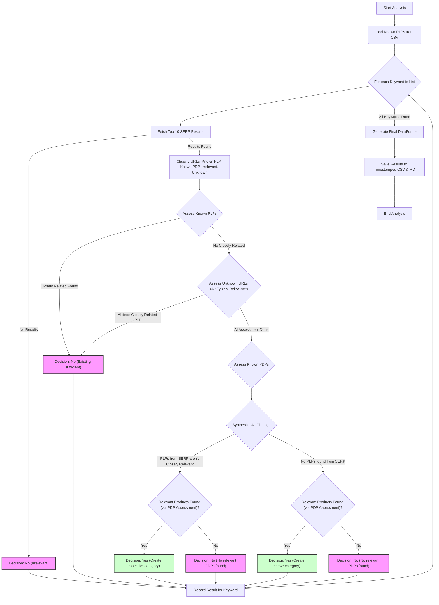

# Category Opportunity Analyzer

This script analyzes a list of keywords (potential e-commerce categories or topics) to determine if creating a dedicated category page on a target website is justified based on existing content found via Google search and AI relevance assessment. It uses AI to classify unknown URL types and assess relevance more accurately.

## Prerequisites

1.  **Python 3:** Ensure you have Python 3 installed.
2.  **Libraries:** Install required libraries:
    ```bash
    pip install pandas requests python-dotenv firecrawl-py pydantic
    ```
3.  **API Keys:**
    *   **SerpApi:** Obtain an API key from [SerpApi](https://serpapi.com/).
    *   **Firecrawl:** Obtain an API key from [Firecrawl](https://firecrawl.dev/).
4.  **Environment File:** Create a file named `.env` in the same directory as the scripts and add your API keys:
    ```dotenv
    serpapi_api_key=YOUR_SERPAPI_KEY
    firecrawl_api_key=YOUR_FIRECRAWL_KEY
    ```

## Configuration

Before running, configure the following settings directly within the `main_analyzer.py` script:

*   `TARGET_SITE`: The domain name of the website you want to analyze (e.g., `"example.com"`).
*   `KNOWN_PLP_PATHS`: A list of URL path prefixes that identify known Product Listing Pages (PLPs).
*   `KNOWN_PDP_PATHS`: A list of URL path prefixes that identify known Product Detail Pages (PDPs).
*   `KNOWN_IRRELEVANT_PATHS`: A list of URL path prefixes (or exact URLs like the homepage) to ignore during analysis (e.g., `/articles/`, `/help/`).
*   `KNOWN_PLPS_CSV_PATH`: (Optional but recommended) Path to a CSV file containing a list of known PLP URLs for more accurate classification. The CSV should have a column named `URL`.
*   `KEYWORD_LIST`: The list of keywords or topics you want to analyze.
*   `DELAY_BETWEEN_KEYWORDS`: Delay in seconds between processing each keyword.
*   `DELAY_BETWEEN_URL_ASSESSMENTS`: Delay in seconds between individual Firecrawl API calls.
*   `OUTPUT_FILENAME_BASE`: The base name for the output files (e.g., `'outputs/category_opportunity_analysis'`). Timestamps and extensions (`.csv`, `.md`) will be appended automatically.

## How to Run

1.  Ensure your `.env` file is set up with API keys.
2.  Configure the settings in `main_analyzer.py` as needed.
3.  Run the script from your terminal:
    ```bash
    python main_analyzer.py
    ```
4.  The script will log its progress to the console and save the results to timestamped CSV and Markdown files in the specified output directory (e.g., `outputs/category_opportunity_analysis_YYYYMMDD_HHMMSS.csv` and `.md`).

## Workflow

The script follows this refined process for each keyword:



## Output Files

Two files are generated for each run, with identical timestamps:

1.  **`*_YYYYMMDD_HHMMSS.csv`**: Contains the detailed analysis data.
2.  **`*_YYYYMMDD_HHMMSS.md`**: Provides a formatted, readable report summary and detailed breakdown.

### CSV File Columns

*   `Keyword`: The keyword/topic analyzed.
*   `Decision`: The final recommendation (e.g., `Yes (Create *new* category)`, `No (Existing page sufficient)`). See Markdown report for full list.
*   `Justification`: A brief explanation for the `Decision`.
*   `SERP_Results_Found`: Boolean indicating if any organic results were found on the target site.
*   `SERP_Raw_HTML_URL`: Link to the cached SerpApi raw HTML file for the search results.
*   `Initial_Classification`: String representation of a dictionary showing counts of URLs initially classified based on patterns (`{'Known PLP': [...], 'Known PDP': [...], ...}`).
*   `Known_PLP_Assessment`: String representation of a dictionary containing relevance assessment results for URLs initially classified as Known PLPs (`{url: {'Relevant': '...', 'Analysis': '...'}}`).
*   `Known_PDP_Assessment`: String representation of a dictionary containing relevance assessment results for URLs initially classified as Known PDPs (`{url: {'Relevance': '...', 'Analysis': '...'}}`).
*   `Unknown_URL_Assessment`: String representation of a dictionary containing AI classification and relevance assessment results for URLs initially classified as Unknown (`{url: {'determined_type': '...', 'relevance': '...', 'analysis': '...'}}`).

### Markdown Report (`.md`)

Provides a human-readable summary of identified opportunities followed by a detailed breakdown for each keyword, including the final decision, justification, SERP details, and the results of each assessment stage (Known PLP, Known PDP, Unknown URL AI Assessment).